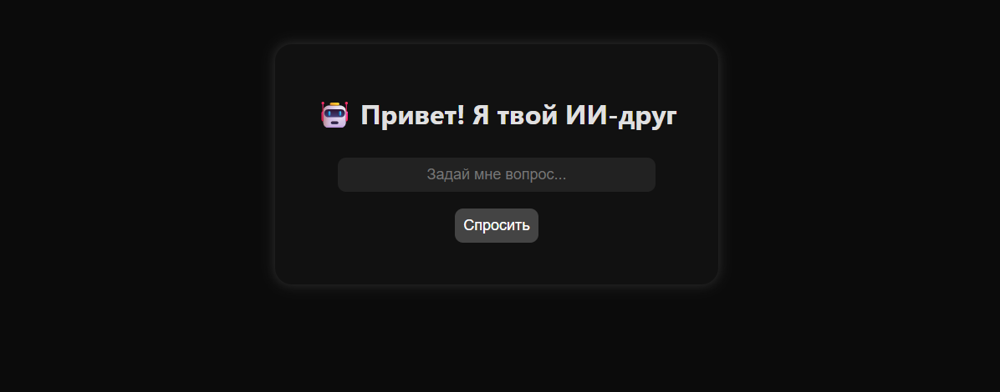

# neuron-ai-chat
Simple AI chat application build with Python and Flask

Neuron AI Chat

Simple AI assistant built with Python and Flask.

This project demonstrates a basic AI chat interface connected to a local knowledge base.

Features

- simple AI chat interface
- knowledge base responses
- Flask backend
- lightweight web interface
- easy to extend with new knowledge

Technologies

- Python
- Flask
- HTML
- CSS
- JavaScript

Live Demo

https://fajhwu0-web.github.io/neuron-ai-chat/

Screenshots

Project Structure

app.py – Flask server
knowledge.txt – knowledge base
templates/ – HTML templates
static/ – CSS and JavaScript

Purpose

This project was created as a learning example of how a simple AI assistant can be built using Flask and a basic knowledge system.

## How to run the project

1. Install Python
2. Install Flask

pip install flask

3. Run the server

python app.py

4. Open in browser

http://127.0.0.1:5000
